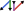

<div align="center">

<picture>
  <source media="(prefers-color-scheme: light)" srcset="docs/build/assets/logo.svg">
  
</picture>

**Vectorization in Julia, made convenient.**

[](https://github.com/nicomignoni/NamedVectorizations.jl/actions/workflows/documentation.yml)

</div>

> [!NOTE]
> As of now, `NamedVectorizations.jl` almost overlaps with [`ComponentArrays.jl`](https://github.com/SciML/ComponentArrays.jl).

Install `NamedVectorizations.jl` from the Julia REPL
```julia
] add https://github.com/nicomignoni/NamedVectorizations.jl.git
```

Check out the [docs](https://nicomignoni.github.io/NamedVectorizations.jl/dev/) for a quickstart. 
